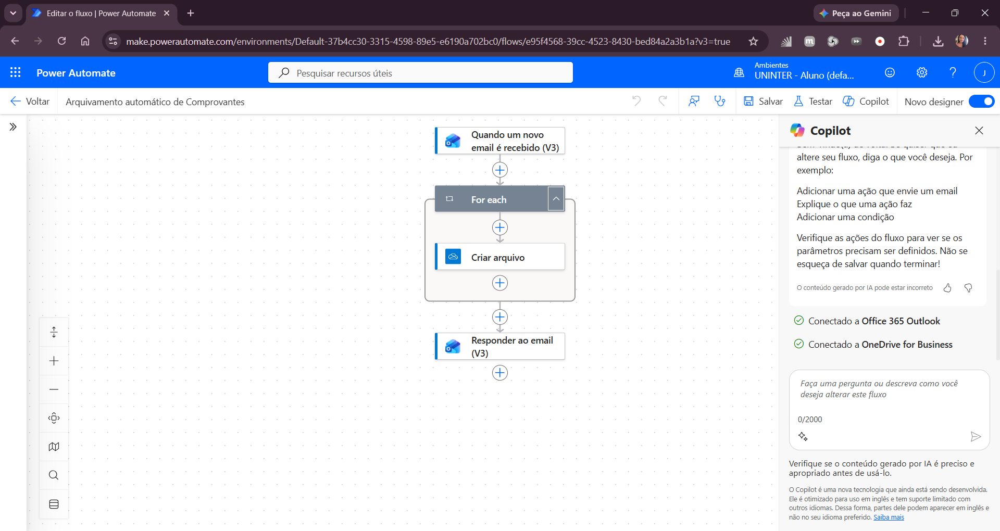
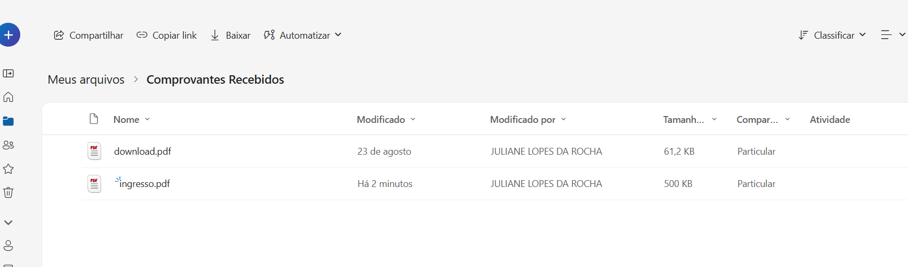
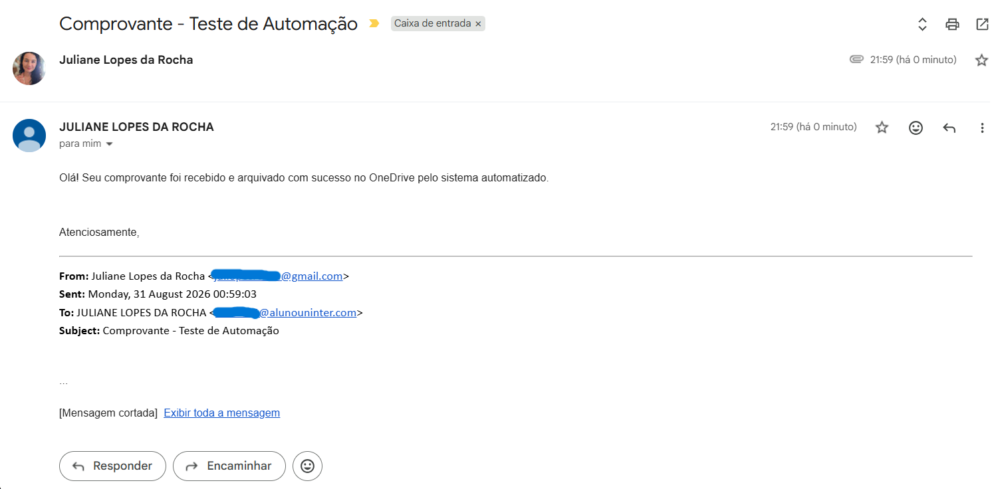

# 📂 Arquivamento Automático de Comprovantes com Power Automate

Automação desenvolvida no **Microsoft Power Automate** para identificar e-mails com comprovantes, arquivar automaticamente seus anexos no **OneDrive for Business** e enviar uma confirmação ao remetente.

## 🎯 Objetivo

Simular a automação de uma tarefa administrativa repetitiva: receber comprovantes por e-mail, salvar os arquivos em uma pasta organizada e confirmar o recebimento.

O fluxo reduz etapas manuais de download, arquivamento e resposta ao remetente.

## ⚙️ Como funciona

O fluxo é iniciado automaticamente quando um novo e-mail atende aos critérios configurados:

- recebido na caixa de entrada (`Inbox`);
- assunto contendo `Comprovante`;
- presença de pelo menos um anexo.

Os anexos são incluídos no gatilho para que possam ser processados nas etapas seguintes.

### Fluxo da automação



A sequência executada é:

```text
Novo e-mail recebido
        │
        ▼
Assunto contém "Comprovante"
e possui anexo
        │
        ▼
Percorre os anexos
        │
        ▼
Cria cada arquivo no OneDrive
        │
        ▼
Responde ao e-mail original
```

## 📎 Processamento dos anexos

O fluxo utiliza um `For each` para percorrer os anexos recebidos.

Para cada anexo, a ação **Criar arquivo** salva o conteúdo na pasta:

```text
/Comprovantes Recebidos
```

no OneDrive for Business.

O nome original do anexo é preservado e seu conteúdo é utilizado na criação do arquivo.

Isso permite que um mesmo e-mail com múltiplos anexos tenha cada arquivo processado individualmente.

## ✉️ Confirmação automática

Após o arquivamento, o fluxo utiliza o ID da mensagem que iniciou a automação para responder ao próprio e-mail recebido.

A resposta informa que o comprovante foi recebido e arquivado com sucesso.

## 📸 Demonstração

### Arquivo arquivado automaticamente no OneDrive



O anexo enviado no teste foi criado automaticamente na pasta configurada no OneDrive.

### Resposta automática ao remetente



Após o processamento, o fluxo respondeu automaticamente ao e-mail original confirmando o arquivamento.

## 🛠️ Tecnologias e serviços

- Microsoft Power Automate
- Office 365 Outlook
- OneDrive for Business
- Cloud Flow
- processamento de conteúdo dinâmico
- automação baseada em eventos

## 🔄 Lógica do fluxo

O projeto utiliza alguns conceitos importantes do Power Automate:

**Trigger baseado em evento**  
O fluxo é iniciado pela chegada de um novo e-mail que atende aos critérios configurados.

**Filtros no gatilho**  
O assunto e a presença de anexos determinam quais mensagens iniciam o processamento.

**Conteúdo dinâmico**  
Informações provenientes do e-mail e dos anexos são reutilizadas nas ações seguintes.

**Iteração**  
O `For each` permite processar individualmente cada anexo recebido.

**Integração entre serviços**  
O Outlook inicia o processo e o OneDrive recebe os arquivos, enquanto o próprio Outlook é utilizado novamente para a confirmação.

## 📚 O que pratiquei

Durante o desenvolvimento deste projeto, pratiquei:

- criação de fluxos automatizados no Power Automate;
- configuração de triggers;
- integração entre Outlook e OneDrive;
- utilização de filtros em eventos;
- processamento de anexos;
- utilização de conteúdo dinâmico;
- estruturas de repetição com `For each`;
- automação de tarefas administrativas;
- testes de execução ponta a ponta.

## 📌 Contexto

Projeto desenvolvido como prática de **automação de processos com Microsoft Power Automate**.

A automação representa um cenário administrativo em que documentos recebidos por e-mail precisam ser armazenados e ter seu recebimento confirmado, transformando uma sequência manual de tarefas em um fluxo automatizado.
